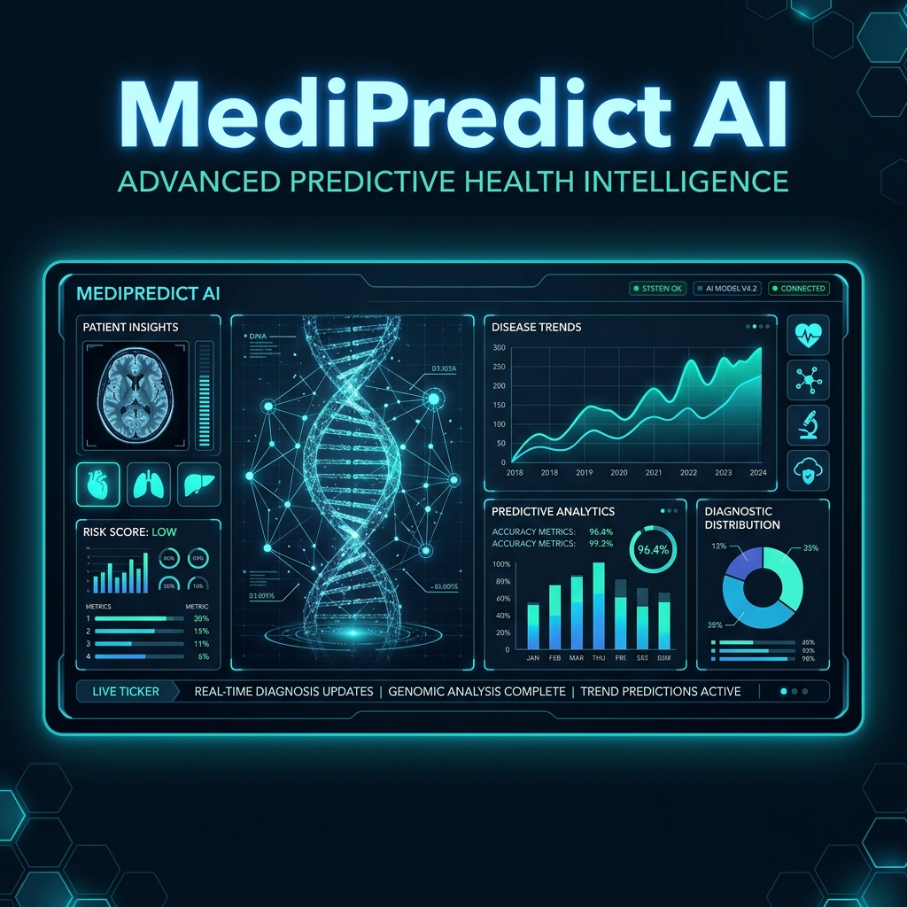

# ⚕ MediPredict AI — Age & Gender Based Patient Analysis System



## 🌟 Overview

**MediPredict AI** is a professional-grade health intelligence platform that leverages **Machine Learning** to analyze patient data and predict potential disease risks based on age and gender. By identifying epidemiological patterns within a large-scale synthetic dataset of 15,000+ records, the system provides both current risk assessments and future health projections.

The project features a sleek, dark-themed **glassmorphism** dashboard with real-time analytics, interactive charts, and a pre-trained **Random Forest** model for high-accuracy predictions.

---

## 🚀 Key Features

### 🔍 Intelligence & Prediction
- **Personalized Risk Assessment**: Get instant predictions for top 5 potential disease risks based on age and gender.
- **Future Trend Projections**: Forecast health risks 10, 20, and 30 years into the future.
- **Preventative Encyclopedia**: Contextual medical advice and preventative measures for 15+ monitored conditions.

### 📊 Advanced Analytics
- **Prevalence Dashboard**: Interactive Doughnut and Bar charts showing disease distribution across demographics.
- **Trend Analysis**: Line charts visualizing how disease risks evolve across age groups.
- **Intensity Heatmap**: A sophisticated Age × Disease heatmap identifying high-risk intersections.

### 🎨 Modern UI/UX
- **Glassmorphism Interface**: A stunning, responsive design with translucent elements and vibrant gradients.
- **Interactive Particles**: Dynamic background animations for an "Alive" interface feel.
- **Live Status Monitoring**: Real-time feedback on API connectivity and model loading.

---

## 🛠️ Tech Stack

### Backend (The Brain)
- **Python 3.x**: Core logic and data processing.
- **Flask**: Lightweight RESTful API architecture.
- **Scikit-Learn**: Machine Learning implementation (Random Forest Classifier).
- **Pandas & NumPy**: High-performance data manipulation.
- **Joblib**: Efficient model serialization and loading.

### Frontend (The Face)
- **HTML5 & Vanilla CSS**: Performance-optimized structure and glassmorphism styling.
- **JavaScript (ES6)**: Dynamic UI transitions and API integration.
- **Chart.js**: Professional data visualization for analytics and trends.
- **Google Fonts**: Inter & Orbitron for a high-tech medical aesthetic.

---

## 📂 Project Structure

```text
patient-analysis/
├── backend/
│   ├── data/               # Synthetic patient datasets
│   ├── models/             # Trained ML models and encoders
│   ├── app.py              # Flask API server
│   ├── model_trainer.py    # Training & analytics script
│   └── requirements.txt    # Backend dependencies
├── frontend/
│   ├── css/                # Glassmorphism styles
│   ├── js/                 # API logic & Chart configurations
│   └── index.html          # Main dashboard
├── assets/                 # README banners and documentation images
├── .gitignore              # Git exclusion rules
└── README.md               # Project documentation
```

---

## ⚙️ Installation & Setup

### 1. Clone the Repository
```bash
git clone https://github.com/pratyushhh-sys/Patient-Analysis.git
cd Patient-Analysis
```

### 2. Set Up Backend
```bash
cd backend
python -m venv venv
source venv/bin/activate  # On Windows: venv\Scripts\activate
pip install -r requirements.txt
```

### 3. Train the Model (Optional)
The project comes with pre-trained models, but you can retrain them to refresh the precomputed stats:
```bash
python model_trainer.py
```

### 4. Run the Application
```bash
python app.py
```
Open your browser and navigate to `http://localhost:5000`.

---

## 🩺 Monitored Diseases
The system tracks and analyzes 15+ chronic and acute conditions, including:
- **Cardiovascular**: Hypertension, Coronary Artery Disease.
- **Metabolic**: Type 2 Diabetes, Obesity.
- **Respiratory**: Asthma, COPD.
- **Mental Health**: Anxiety Disorder, Depression.
- **Other**: Osteoporosis, Migraine, Thyroid Disorders, Arthritis, Kidney/Liver Disease.

---

## ⚠️ Disclaimer

This system is built for **educational and research purposes only**. The predictions generated are based on synthetic statistical trends and do not constitute professional medical advice, diagnosis, or treatment. Always consult with a qualified healthcare provider for any medical concerns.

---

